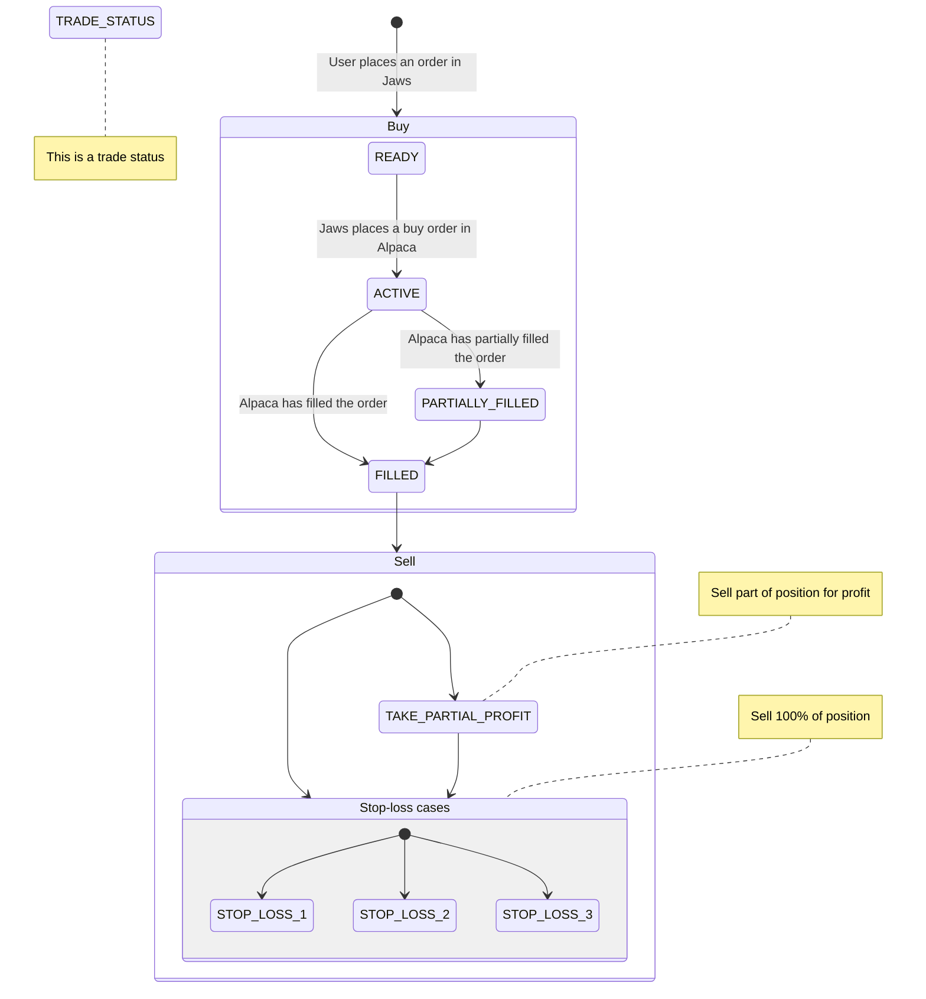

# Trading logic

## `TRADE_STATUS` flow chart

```mermaid
stateDiagram-v2

    TRADE_STATUS
    note right of TRADE_STATUS
        This is a trade status
    end note

    [*] --> Buy : User places an order in Jaws

    state Buy {

        READY --> ACTIVE : Jaws places a buy order in Alpaca

        ACTIVE --> FILLED : Alpaca has filled the order
        ACTIVE --> PARTIALLY_FILLED : Alpaca has partially filled the order

        PARTIALLY_FILLED --> FILLED
    }

    FILLED --> Sell

    state Sell {
        [*] --> TAKE_PARTIAL_PROFIT
        [*] --> StopLoss

        note left of TAKE_PARTIAL_PROFIT
            Sell part of position for profit
        end note
        TAKE_PARTIAL_PROFIT --> StopLoss

        note left of StopLoss
            Sell 100% of position
        end note
        StopLoss: Stop-loss cases
        state StopLoss {
            [*] --> STOP_LOSS_1
            [*] --> STOP_LOSS_2
            [*] --> STOP_LOSS_3
        }
    }
```
