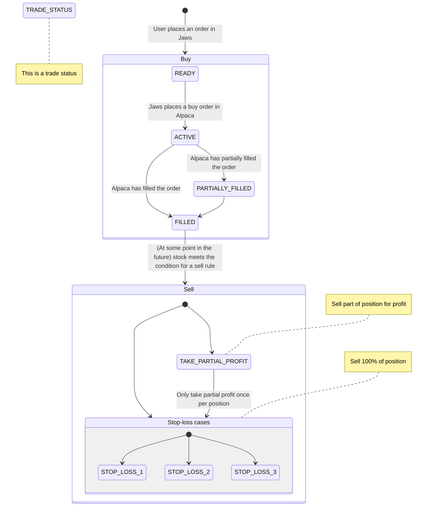

# Trading logic

Jaws stores positions for a stock in an object called `trade`. Trades
describe things like entry price and the desired action for a position,
and somewhat reflect the status of [orders in
Alpaca](https://alpaca.markets/docs/trading/orders/).

## When are orders triggered?

The buying and selling endpoints are triggered externally by scheduled
cronjobs. For more info on the scheduled jobs, see
[scheduling.md](./scheduling.md).

## Trade status

The state of a trade is represented by the `TRADE_STATUS` enum (declared
in [tradesMeta.ts](../src/db/tradesMeta.ts)). Its different values and
how they are used are described in the flowchart below, and further in
the [Buying](#buying) and [Selling](#selling) sections.

### `TRADE_STATUS` flowchart

## Buying

Users can buy a position for a specific breakout. Sharkster sets a
breakout value, and Jaws recommends the quantity of stocks to buy, so
that the total value of the purchase does not exceed 10% of the user's
total asset value. The buying procedure works as follows:

1. The user can modify the buying price and place an order. This creates
   a `trade` in Jaws with `TRADE_STATUS.READY`.
1. When the scheduled job to place pending trades is run, all `READY`
   trades are sent to Alpaca as [stop
   orders](https://alpaca.markets/docs/trading/orders/#stop-order) and
   get the status `ACTIVE`.
1. A scheduled job gets all `ACTIVE` trades, check the status of their
   corresponding orders in Alpaca, and updates their status to `FILLED`
   or `PARTIALLY_FILLED`.

## Selling

A position is sold based on a set of rules, and the reason for a sale is
described by the `TRADE_STATUS`.

The rules can be tweaked by changing the constants in
[buySellConstants.ts](../src/lib/buySellHelper/buySellConstants.ts). The
rules written below use the default values for the constants at the time
of writing (i.e. the numbers, percentages, etc.).

| `TRADE_STATUS`        | Active when           | Rule                                                                                                                                              | Sell % of position |
| --------------------- | --------------------- | ------------------------------------------------------------------------------------------------------------------------------------------------- | ------------------ |
| `STOP_LOSS_1`         | From time of purchase | The total value of the position (number of stocks \* current price) is down >= 0.5% of the total value of the portfolio (invested + cash balance) | 100%               |
| `STOP_LOSS_2`         | From day 2            | Price of the stock is **lower** than entry price                                                                                                  | 100%               |
| `STOP_LOSS_3`         | From day 2            | Price of the stock is **lower** than 10-day moving average                                                                                        | 100%               |
| `TAKE_PARTIAL_PROFIT` | From time of purchase | Price of the stock is **higher** than 10% of entry price                                                                                          | 50% (rounded up)   |
